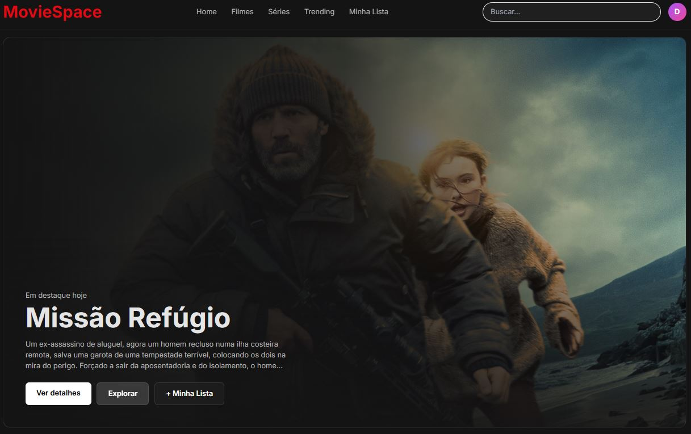
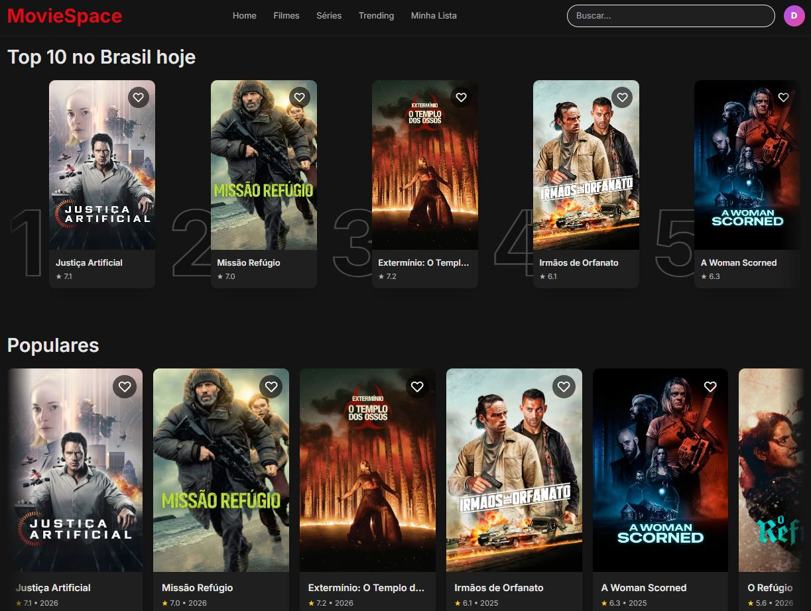
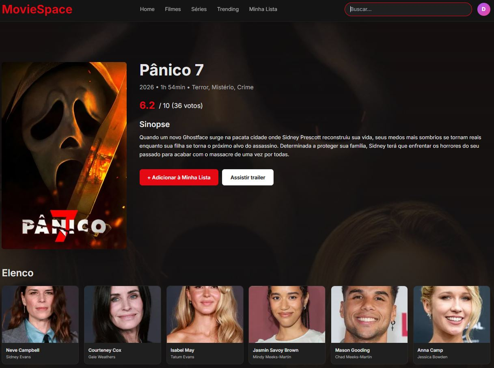
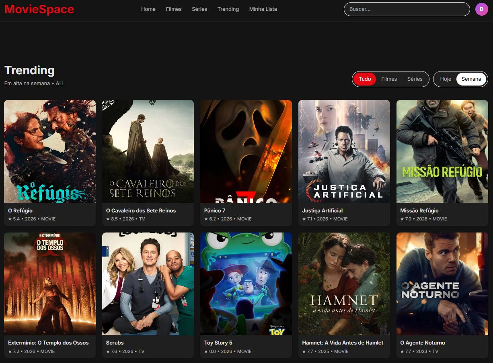

# MovieSpace

Aplicação web para descoberta de filmes e séries inspirada na experiência de plataformas modernas de streaming.
O projeto foi desenvolvido com foco em consumo de APIs reais, organização de arquitetura front-end e construção de uma interface visual consistente.

---

## Features

- Busca global com sugestões em tempo real
- Página de detalhes com sinopse e avaliação
- Lista pessoal persistida no navegador
- Página Trending com filtros por tipo e período
- Exploração por categorias com carrosséis horizontais
- Infinite scroll na busca
- Top 10 por gênero
- Sistema de favoritos integrado

---

## Stack

React • React Router DOM • Context API • TailwindCSS • TMDB API • Vite

---

## Screenshots

  
  

  
  

 

 
 

---

⭐ Projeto desenvolvido para portfólio com objetivo de simular um produto real focado em experiência de navegação, consumo de dados e padrões modernos de interface.